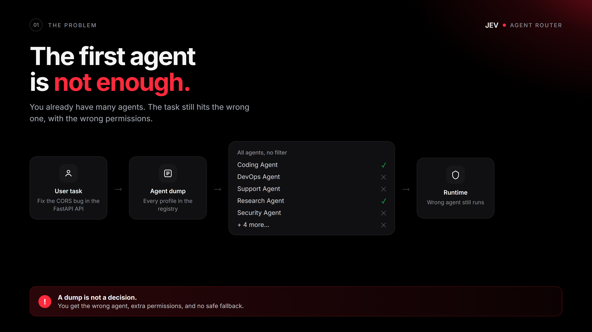
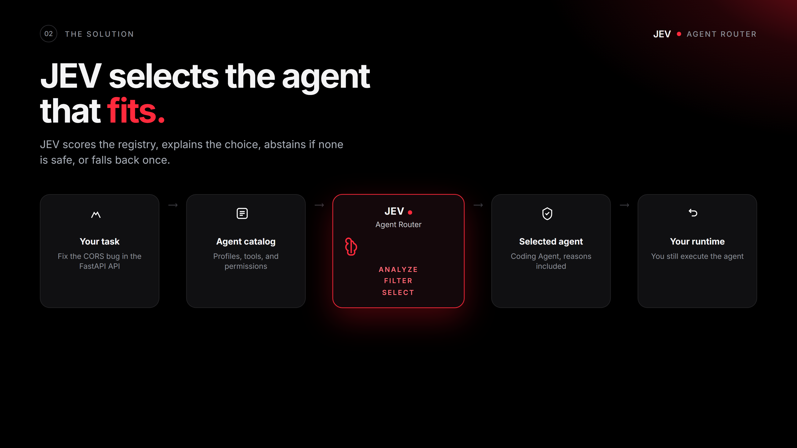
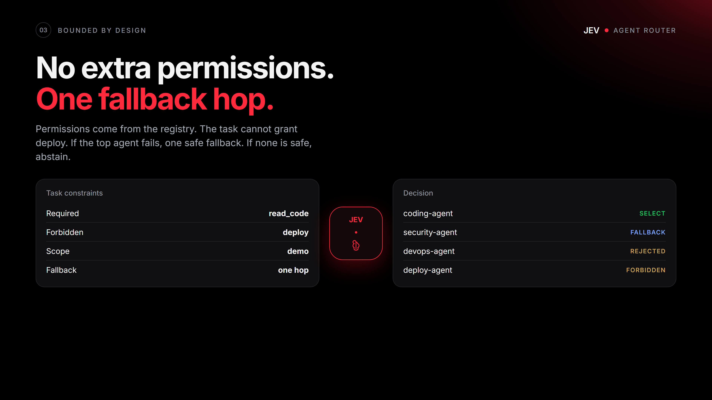
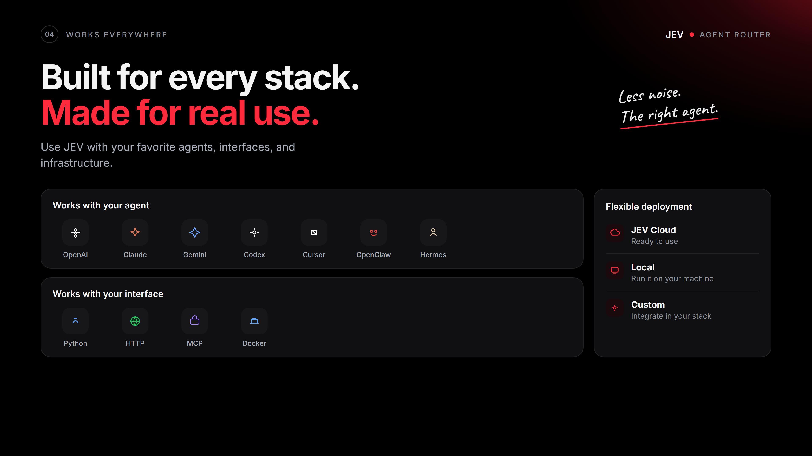

# jev-agent-router

Picks the agent that fits the task, then explains, abstains, or falls back once.

Author: [Pinuts](https://github.com/Pinutss). MIT license.

Part of [JEV Labs](https://github.com/Pinutss/jev-labs).

Stack: Python 3.10+, HTTP, MCP stdio, Docker, HTML demo.

After `jev-agent serve`: [demo](http://127.0.0.1:8080/)

<p>
  
  
</p>
<p>
  
  
</p>

## Local, no keys

```bash
git clone https://github.com/Pinutss/jev-agent-router
cd jev-agent-router
uv sync
uv run jev-agent demo
uv run jev-agent serve
```

No agent and no LLM are required. `JEV_PROVIDER=auto` (the default) stays on the local heuristic. If JEV and a gateway are configured, they are used as the judge. Docker:

```bash
docker compose up
```

## What the prototype does

The router chooses an agent from a registry. It explains the choice, abstains if no candidate is safe, and allows only one fallback hop.

It does not run agents and does not ship them.

Permissions come only from the registry and the caller constraints. The task, a tool, or a model cannot add them.

## Hermes and OpenClaw

Yes, locally. The MCP process does not need JEV or a gateway:

```bash
uv run jev-agent mcp
```

One tool: `agent_route`. Pass `task` + `agents`. Keys stay in the process environment, not in the call.

**Hermes** (`~/.hermes/config.yaml`):

```yaml
mcp_servers:
  jev-agent:
    command: uv
    args: ["run", "--directory", "/path/to/jev-agent-router", "jev-agent", "mcp"]
    env:
      JEV_PROVIDER: local
```

**OpenClaw** (`~/.openclaw/openclaw.json`, or Settings > MCP > Stdio):

```json
{
  "mcp": {
    "servers": {
      "jev-agent": {
        "command": "uv",
        "args": ["run", "--directory", "/path/to/jev-agent-router", "jev-agent", "mcp"],
        "env": { "JEV_PROVIDER": "local" }
      }
    }
  }
}
```

Copy-ready examples: `examples/hermes.yaml`, `examples/openclaw.json`.

## Python

```python
from jev_agent_router import AgentRouter, DEFAULT_AGENTS

result = AgentRouter(provider="local").route(
    task="Fix the CORS bug in the FastAPI API",
    agents=DEFAULT_AGENTS,
    required_permissions=["read_code"],
    scope="demo",
)
print(result.decision, result.selected.id if result.selected else result.abstain_reason)
```

## JEV + several LLMs (optional)

If you wire the cloud later: `JEV_API_KEY` / `JEV_BASE_URL`, plus an OpenAI-compatible gateway. Keys stay in the environment, never in the HTTP body or the MCP call.

One multi-model key (OpenRouter):

```env
JEV_PROVIDER=jev
OPENROUTER_API_KEY=sk-or-...
JEV_LLM_DEFAULT=openrouter:anthropic/claude-sonnet-4
JEV_LLM_STRATEGY=named
```

Several providers:

```env
OPENROUTER_API_KEY=sk-or-...
OPENAI_API_KEY=sk-...
GROQ_API_KEY=gsk_...
JEV_LLM_PROVIDERS=openrouter,openai,groq
JEV_LLM_STRATEGY=cheapest
```

Or a file such as `examples/models.json` via `JEV_MODELS_FILE`. Classic `GATEWAY_*` still works.

```bash
cp .env.example .env
uv run jev-agent llms
```

`GET /v1/llms` lists the public catalog (`has_key`, `api_key_env`), never the raw key. To pick the judge from the call: `gateway_provider`, `gateway_model`, `llm_prefer`.

`JEV_PROVIDER=jev` will not start if JEV or no usable LLM is configured. With `auto`, missing keys just keep the local heuristic.

## HTTP

```bash
uv run jev-agent serve
```

`GET /healthz`, `POST /v1/route`. Binds `127.0.0.1`. The body must not contain keys.

## Local validation

```bash
uv run jev-agent benchmark
```

Annotated set in `benchmarks/annotated_tasks.json`. This is a local baseline, not a live JEV trial.

## Limits

Local ranking is lexical and deterministic. Scope isolates lists, it is not auth. One fallback hop. No agent runtime. No store, no PyPI yet.

`docs/vision.md` is a long-term target, not the current contract.
